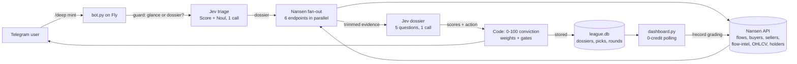

# Fantasy Smart Money League + Due-Diligence Copilot

Nansen Meridian Buildathon entry. A Telegram game where you draft proven
smart-money wallets into weekly rounds settled on live Nansen PnL — plus a
copilot that turns any token's smart-money flow into a graded 0–100 dossier
in ~6 seconds.

- **Play:** [@righttofight_bot](https://t.me/righttofight_bot) on Telegram
- **Watch:** [smart-money-league.fly.dev](https://smart-money-league.fly.dev/)
  (convictions, leaderboard, track record, credit economy — refreshes every 20s)
- **Stack:** Nansen data → Jev (TypeSafe System One) triage + verdicts →
  Telegram game. LLMs are reserved for deep dives only.

## Why

Token due-diligence bots are either slow LLM essays or raw dashboards.
Nansen already *is* the dashboard, so another one can't win. What wins is a
loop (weekly draft rounds), a memorable demo moment (the 6-second dossier),
and data only Nansen has (smart-money labels, PnL leaderboards, fund flows).

The distinctive idea: **the bot rations its own API budget.** Every Nansen
call burns credits, so a calibrated Jev judgment decides *how deep to look*
before a single credit is spent — 1cr glance vs 10cr dossier — and every
verdict is later graded against actual price. The system proves its own edge
on the dashboard instead of claiming it.

## How it works



`/check` is the same pipeline at low cost (guard → 1–6cr → single verdict).
`/record` replays stored dossiers against subsequent OHLCV closes into a
hit-rate table — the validation loop anyone can re-run.

## Commands

| Command | Cost | What happens |
|---|---|---|
| `/check <mint>` | 1–6cr | Jev guard → flows (1cr), +PnL leaderboard (5cr) if convicted → verdict + confidence |
| `/deep <mint>` | 10cr | 6-endpoint parallel fan-out → one 5-question Jev batch → 0–100 conviction, stored for grading |
| `/record` | 1cr/dossier | Grades past dossiers vs subsequent price → hit-rate table |
| `/board` | 5cr (cached 10m) | Top smart-money wallets with tap-to-copy `/draft` commands |
| `/draft <wallet>` | 0 + 2cr scout | Drafts into the weekly round, then profiler bundle → Jev S/A/B/C scout grade |
| `/picks`, `/settle` | 0 / 5cr | Your picks; anyone can settle the round on live PnL |
| `/budget` | 0 | Today's burn vs cap, per-endpoint breakdown |

## Nansen APIs used

| Endpoint | Cost | Used for |
|---|---|---|
| `smart-money-pnl-leaderboard` | 5cr | League settlement + `/board` — realized/unrealized PnL, win rate, trades |
| `token flows` | 1cr | 7d flow history (first-glance evidence) |
| `token who-bought-sold` (BUY + SELL) | 1cr each | Labeled-buyer conviction: who accumulates, who distributes |
| `token flow-intelligence` | 1cr | Per-segment net flow (smart-money slice) |
| `token holders` | 5cr | Concentration / whale-risk evidence |
| `token pnl` | 5cr | Per-token PnL leaderboard (deep `/check`) |
| `token ohlcv` | 1cr | Dossier entry price + `/record` grading closes |
| `token info` | 1cr | Sanity metadata |
| `token screener` | 1cr | Discovering seed tokens by live volume |
| `profiler pnl-summary` | 1cr | Draft scout: top tokens, realized PnL/ROI |
| `profiler balance` | 1cr | Draft scout: current book |
| `search general` | 0cr | Mint discovery (free) |

Solana only — the CLI's Ethereum token paths hang, so the bot defaults to
Solana and says so. Coverage varies by token (majors are rich, long-tail is thin);
thin evidence flows into low Jev confidence, which is itself the signal.

## Jev judgments (all typed, all batched)

One batched `POST /v1/systemone` (`jev-latest`) per decision — independent
questions run in parallel, code owns thresholds and composition:

- **Triage** (`triage_token`): `bullishness` Score + `worth_deep_dive` Noul →
  plan is `deep` (guard ≥ 0.65, conf ≥ 0.5), `glance` (guard ≤ 0.35), else
  `escalate` to LLM teardown.
- **Dossier** (`dossier`): `bullishness` + `accumulation` + `whale_risk`
  Scores, `dumping` Noul, `action` Choice (accumulate/watch/avoid) →
  conviction = 40·bull + 30·acc + 20·safety + 10·action-confidence, gated:
  `avoid`/dump>0.7 caps at 25, `watch` caps at 55, avg-conf < 0.5 escalates.
- **Scout** (`scout_wallet`): `consistency` + `degen` Scores → S/A/B/C grade
  composed in code.
- API notes: Score/Choice take **`criteria`** (Score: ordered level array;
  Choice: `{option: description}` map) — `levels` 422s. Choice answers carry
  `.choice` + full distribution + confidence. `judge()` retries transient
  network blips with backoff.

Typed output guarantees the interface, not truth — hence `/record`.

## Credit economy

Per-action caps (`glance` 1, `deep` 6, `dossier` 10, `scout` 2, `record` 4,
`settle` 5), 100cr/day hard stop, 10-minute file cache so re-renders and
dashboard polls burn nothing, every burn appended to `.spend_log.jsonl`.
Observed: full dossier ≈ 10cr in ~5s; R&D to date ≈ 100cr of a five-figure
balance. Seeded track record: STONK 25/avoid, PUMP 25/avoid, ETH 26/watch,
HYPE 38/watch, CBBTC 40/watch (Sep 2026 — graded live via `/record`).

## Project layout

- `bot.py` — Telegram handlers; every failure reports back, nothing hangs
- `jev.py` — TypeSafe client: triage, dossier, scout + conviction composer
- `nansen_client.py` — CLI wrapper: budget guard, TTL cache, parallel `fan()`
- `league.py` — sqlite: users, picks, rounds, dossiers
- `dashboard.py` + `static/` — stdlib read-only web UI (LeagueDesk)
- `seed_dossiers.py` — batch dossier seeding Friday ritual
- `Dockerfile`, `start.sh`, `fly.toml`, `DEPLOY.md` — one-machine Fly deploy

## Run locally / deploy

```bash
pip install -r requirements.txt
cp .env.example .env   # NANSEN_API_KEY, TELEGRAM_BOT_TOKEN
export TYPESAFE_API_KEY=$(cat ~/.config/typesafe/api_key)
python bot.py          # Telegram polling
python dashboard.py    # http://127.0.0.1:8765
```

Production is one Fly machine (bot + dashboard, sqlite on a volume) —
see `DEPLOY.md`. Never run the local bot alongside Fly: two pollers cause
Telegram getUpdates 409 Conflict.

## Vision & roadmap

- [x] Instant verdicts + credit guard + escalation ladder
- [x] `/deep` dossier engine (6 endpoints → 5 judgments → conviction)
- [x] Self-grading `/record` + live dashboard + Fly deploy
- [ ] **Calibration report**: 20+ graded dossiers → publish hit-rate by
  conviction bucket (the chart that wins arguments)
- [ ] **Copy-trader detection**: profiler `related-wallets` + counterparty
  overlap → Jev same-operator Noul → warn on correlated drafts
- [ ] **EVM support** once CLI paths stabilize (currently Solana-only)
- [ ] **Bear-case mode**: the copilot that talks you out of your bag,
  as a first-class command
- [ ] **Real stakes**: entry fees in USDC covering query costs onchain,
  payouts to round winners — the economy this points at

## Honest limits

- Jev scores read cautious in current conditions (see seeds) — bias or
  market truth is undecided until `/record` accumulates grades.
- Thin-token evidence → low confidence by design; the bot says "watch",
  not "trust me".
- Free-tier Nansen + ngrok-grade links were the dev path; judging runs on
  Fly with paid credits behind it.
